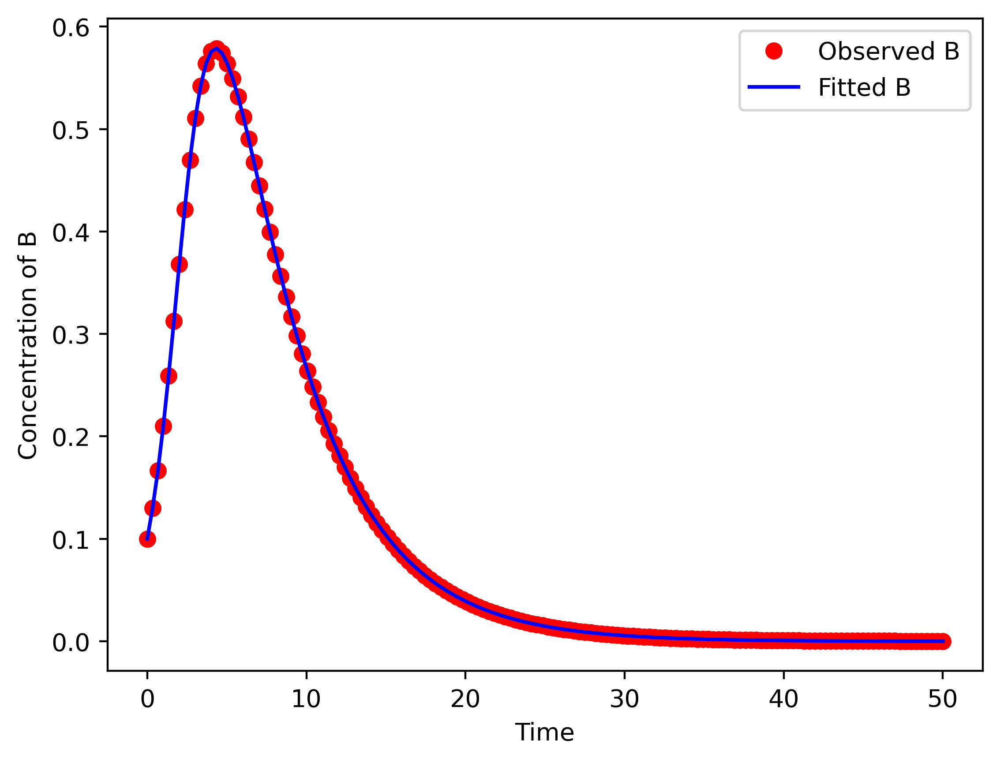

# Optimization of Reaction Kinetics in Autocatalytic Batch Reactions

## Project Overview
This project focuses on optimizing reaction rate constants $k_1$ and \( k_2 \) for an autocatalytic isothermal batch reaction, maximizing the concentration \( C_B \) over time. Using Python's SciPy library, this project models the differential equations governing the reactions and leverages optimization methods to identify values of \( k_1 \) and \( k_2 \) that achieve peak \( C_B \) concentration.

## Table of Contents
- [Background](#background)
- [Objectives](#objectives)
- [Methodology](#methodology)
- [Results](#results)
- [Tech Stack](#tech-stack)
- [How to Use](#how-to-use)

## Background
The reaction under study is an autocatalytic batch reaction where the concentration changes over time according to:

\[
\frac{dC_A}{dt} = -k_1 C_A C_B
\]

\[
\frac{dC_B}{dt} = k_1 C_B C_A - k_2 C_B
\]

\[
\frac{dC_C}{dt} = k_2 C_B
\]

Given experimental concentration data, we aim to find optimal values for \( k_1 \) and \( k_2 \) to maximize \( C_B \) and identify the time at which this maximum occurs.

## Objectives
- Model the system of ODEs describing reaction rates.
- Optimize rate constants \( k_1 \) and \( k_2 \) to maximize \( C_B \).
- Validate the model with experimental data.

## Methodology
1. **Modeling Reaction Kinetics:** Using SciPy's ODE solver to represent the batch reaction system and simulate concentration changes over time.
2. **Optimization of Parameters:** Applying `scipy.optimize` to find the values of \( k_1 \) and \( k_2 \) that maximize \( C_B \).
3. **Result Evaluation:** Analyze and visualize concentration trends, identifying peak \( C_B \) values and times.

## Results


## Tech Stack
- **Python**: Core programming language
- **SciPy**: For solving ODEs and parameter optimization
- **Matplotlib** : For data visualization

## How to Use
1. **Clone the Repository:**
   ```bash
   git clone https://github.com/your-username/Optimization-of-Reaction-Kinetics.git
   cd Optimization-of-Reaction-Kinetics
   
2. **Install Dependencies: Install SciPy and Matplotlib**
   ```bash
   pip install scipy matplotlib

3. **Run the Code: Execute the main script to model the reaction and optimize parameters**
   ```bash
   jupyter notebook model.ipynb
